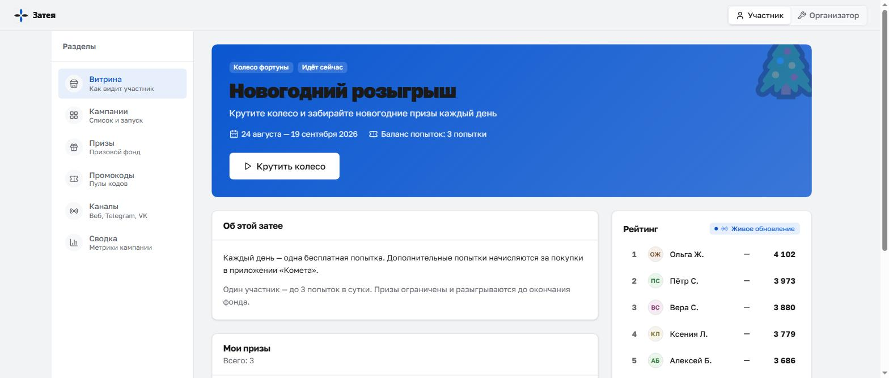
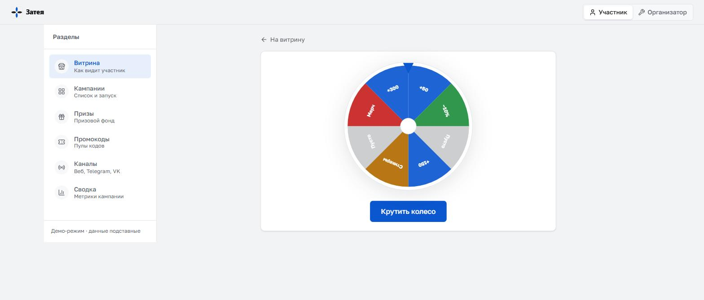
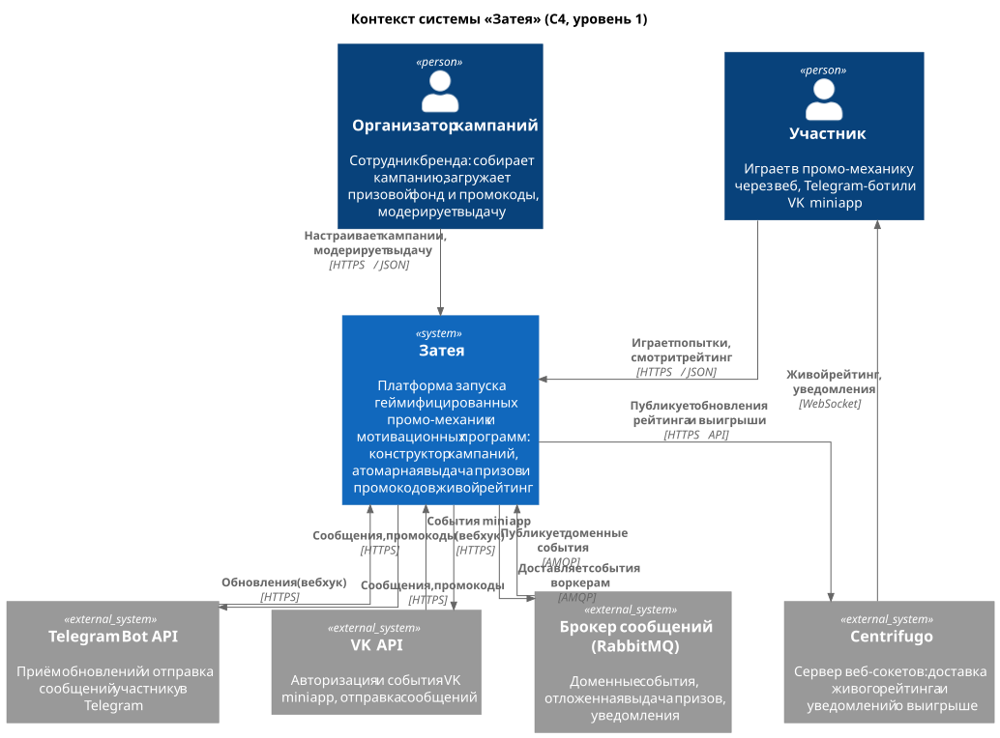
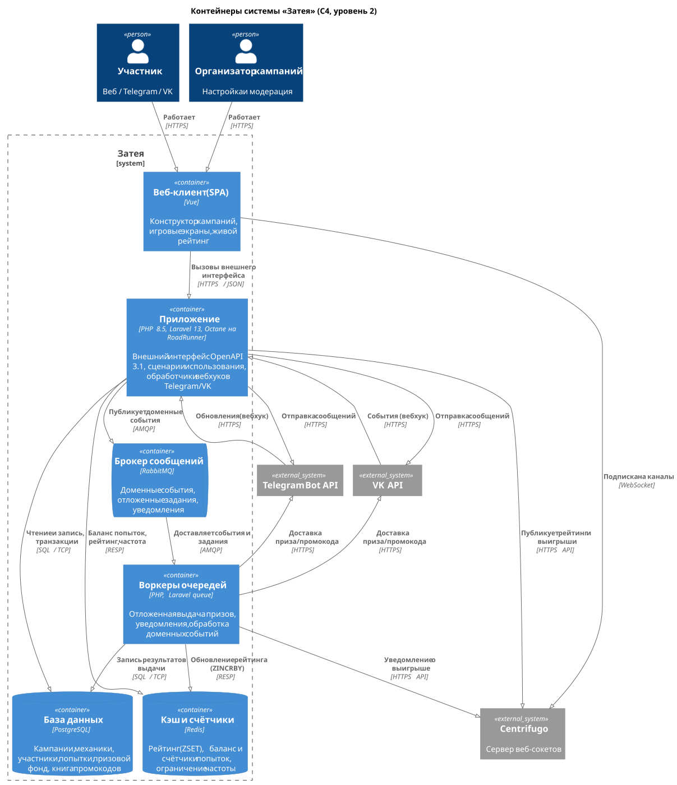
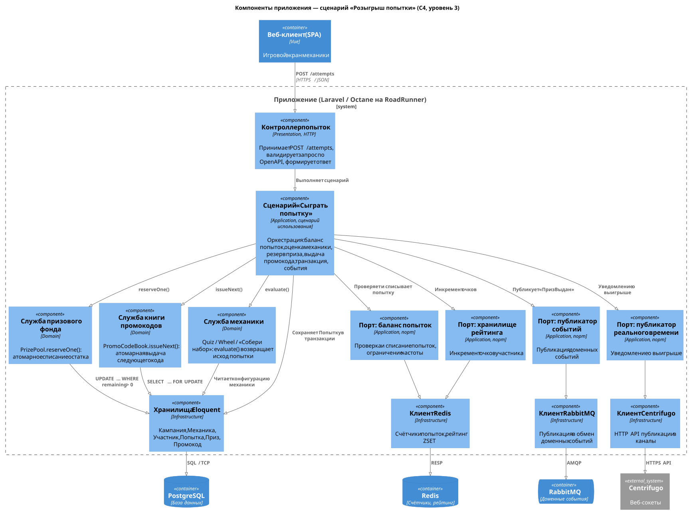
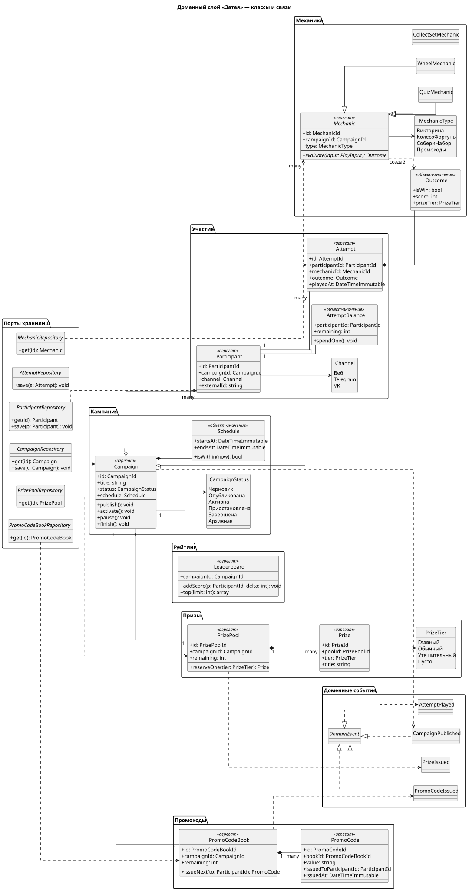
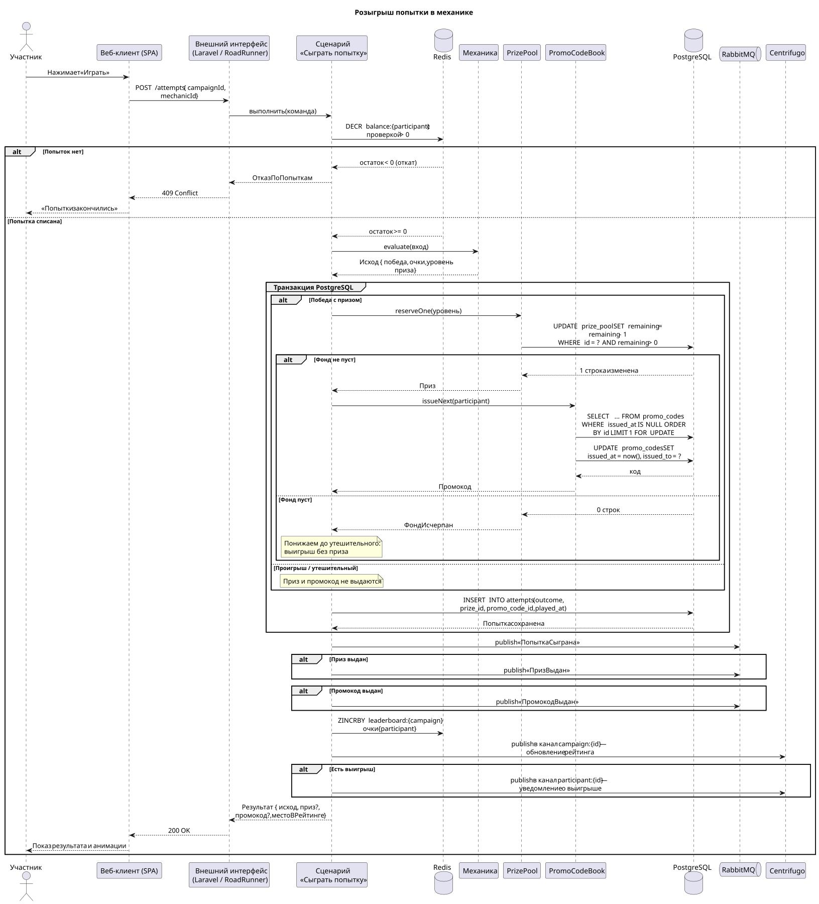
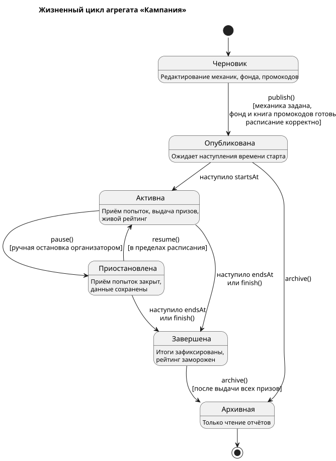

<p align="center">
  
</p>

<p align="center">
  Платформа запуска геймифицированных промо-механик и мотивационных программ.
</p>

<p align="center">
  
  
  
  
  
</p>

---

## О проекте

**«Затея»** — конструктор промо-кампаний для крупного потребительского бизнеса.
Маркетолог собирает кампанию из готовой игровой механики, задаёт период, призовой
фонд и пул промокодов, после чего аудитория участвует через веб, Telegram-бота или
VK mini app. Очки начисляются в общий рейтинг, который обновляется у всех
участников в реальном времени; призы и промокоды выдаются атомарно, без риска
выдать больше, чем есть в фонде.

### Возможности

| Область | Что умеет |
|---|---|
| **Механики** | Викторина и колесо фортуны — полностью; «собери набор» и раздача промокодов — на этапе каркаса |
| **Каналы участия** | Веб-витрина, Telegram-бот (обработчик веб-обработчика с проверкой секрета), VK mini app (проверка подписи запуска и обратных вызовов) |
| **Призовой фонд** | Позиции с остатком; резервирование атомарным условным изменением остатка |
| **Промокоды** | Загрузка списком или файлом CSV; выдача следующего свободного кода с блокировкой строки |
| **Рейтинг** | Упорядоченное множество Redis; живое обновление через веб-сокеты Centrifugo |
| **События предметной области** | Публикация в обменник RabbitMQ (`attempt.played`, `prize.awarded`, `promo_code.issued`, `campaign.published`) |
| **Кабинет организатора** | Создание и публикация кампаний, наполнение фонда, загрузка промокодов, сводка показателей |
| **Программный интерфейс** | Описан спецификацией OpenAPI 3.1 (`docs/openapi/openapi.yaml`) |

Скриншоты интерфейса — в [`docs/screenshots/`](docs/screenshots).

<p align="center">
  
  
</p>

---

## Технический стек

| Слой | Технологии |
|---|---|
| Язык и фреймворк | PHP 8.5, Laravel 13 |
| Сервер приложений | Laravel Octane на RoadRunner (долгоживущий процесс) |
| Хранилище | PostgreSQL 17 |
| Кэш, счётчики, рейтинг, сессии участников | Redis 7 |
| Брокер сообщений | RabbitMQ 3 |
| Веб-сокеты | Centrifugo 5 |
| Внешний интерфейс (клиент) | Vue 3, Vite, TypeScript, Tailwind CSS, собственный набор компонентов в эстетике дизайн-системы Росатома |
| Гейты качества | PHPUnit, PHPStan (уровень 8) + Larastan, PHP CS Fixer, Rector, PHPMD, Deptrac, Infection, Behat, Semgrep |
| Контейнеризация | Docker, docker compose |
| Конвейер | GitLab CI (основной) и GitHub Actions (зеркало) — сборка, качество кода, тесты, безопасность, мутационное тестирование |

---

## Быстрый запуск

### Полное окружение в Docker

```bash
cp .env.example .env
docker compose up --build
```

Поднимаются: приложение на RoadRunner, воркер очередей, PostgreSQL, Redis,
RabbitMQ, Centrifugo и сборка клиента. При первом старте применяются миграции и
наполняется демонстрационная кампания «Колесо новогодних призов».

| Адрес | Назначение |
|---|---|
| `http://localhost:8080/api/v1` | Программный интерфейс |
| `http://localhost:8080/up` | Проверка живости |
| `http://localhost:5173` | Клиентское приложение |
| `http://localhost:15672` | Панель RabbitMQ (`zateya` / `zateya`) |
| `http://localhost:8000` | Centrifugo |

### Проверка вручную

```bash
# карточка демонстрационной кампании
curl http://localhost:8080/api/v1/campaigns/demo

# открыть сессию участника
curl -X POST http://localhost:8080/api/v1/participation/sessions \
  -H 'Content-Type: application/json' \
  -d '{"channel":"web","campaign_slug":"demo","channel_token":"guest-1"}'

# разыграть попытку (маркер — из ответа предыдущего запроса)
curl -X POST http://localhost:8080/api/v1/campaigns/demo/attempts \
  -H 'Authorization: Bearer <маркер>' -H 'Content-Type: application/json' -d '{}'
```

### Локальная разработка без Docker

Нужны PHP 8.5 (с расширениями `pdo_pgsql`, `redis`, `sockets`, `bcmath`, `intl`)
и Composer. Клиент — в каталоге `frontend/` (см. [`frontend/README.md`](frontend/README.md)).

```bash
composer install
cp .env.example .env && php artisan key:generate

# режим без внешних сервисов: SQLite + реализации портов «в памяти»
php artisan migrate --database=sqlite --env=local
php artisan serve
```

Для прогона всех проверок качества:

```bash
bash scripts/quality_gate.sh          # полный гаунтлет
bash scripts/quality_gate.sh --fast   # без мутационного тестирования
```

---

## Архитектура

Проект следует чистой архитектуре (Роберт Мартин). Зависимости направлены строго
внутрь: внешние слои знают о внутренних, обратное запрещено и проверяется
инструментом `deptrac` на каждом прогоне конвейера.

```
Представление ─┐
               ├─► Приложение ─► Предметная область
Инфраструктура ─┘
```

- **Предметная область** (`src/Domain`) — сущности, объекты-значения, доменные
  события и интерфейсы хранилищ. Чистый PHP: ни Laravel, ни базы, ни сети.
- **Приложение** (`src/Application`) — сценарии использования (команда → обработчик
  → результат) и порты инфраструктуры (интерфейсы). Зависит только от предметной
  области.
- **Инфраструктура** (`src/Infrastructure`) — реализации портов и хранилищ:
  Eloquent, клиент Centrifugo, публикатор RabbitMQ, рейтинг и счётчики в Redis.
  Единственный слой с Eloquent и обращениями наружу; для каждого порта есть
  реализация «в памяти» для тестов и локального запуска.
- **Представление** (`src/Presentation`) — точки входа: контроллеры программного
  интерфейса, обработчики веб-обработчиков Telegram и VK, посредники доступа.
  Тонкие: разобрать запрос → вызвать сценарий → преобразовать ответ.
- **`app/`** — минимальный каркас Laravel: связывание интерфейсов с реализациями
  (`DomainServiceProvider`) и склейка исключений.

### Контекст системы (C4, уровень 1)



### Контейнеры (C4, уровень 2)



### Компоненты сценария «розыгрыш попытки» (C4, уровень 3)



### Модель предметной области (UML, классы)



### Розыгрыш попытки (UML, последовательность)

Центральный сценарий: списание попытки, розыгрыш механики, атомарное
резервирование приза и выдача промокода, запись попытки в транзакции, публикация
событий, обновление рейтинга и уведомление участника.



### Жизненный цикл кампании (UML, состояния)



### Модерация и выдача приза (BPMN)



### Выпуск и выдача промокода (BPMN)



Исходники диаграмм и команда пере-рендера — в [`docs/diagrams/`](docs/diagrams).

---

## Организация файлов

```
zateya/
├── src/
│   ├── Domain/                     # предметная область (чистый PHP)
│   │   ├── Campaign/               # агрегат «Кампания», период, состояние, тип механики
│   │   ├── Mechanic/               # механики: Quiz, Wheel; конфигурация и фабрика
│   │   ├── Participation/          # участник, канал, попытка
│   │   ├── Reward/                 # призовой фонд, книга промокодов, выданные награды
│   │   ├── Leaderboard/            # рейтинг и его хранилище (интерфейс)
│   │   ├── Event/                  # доменные события
│   │   └── Shared/                 # часы, идентификатор, базовое исключение
│   ├── Application/
│   │   ├── Campaign/               # создание, публикация, фонд, промокоды, удаление, чтение, сводка
│   │   ├── Participation/          # открытие сессии, розыгрыш попытки, мои призы
│   │   ├── Leaderboard/            # чтение рейтинга
│   │   ├── Port/                   # порты инфраструктуры (интерфейсы)
│   │   └── Shared/                 # исключение уровня сценария
│   ├── Infrastructure/
│   │   ├── Persistence/Eloquent/   # модели, хранилища, менеджер транзакций
│   │   ├── Leaderboard/            # рейтинг: Redis и «в памяти»
│   │   ├── Balance/                # баланс попыток: Redis и «в памяти»
│   │   ├── RateLimit/  Session/    # ограничение частоты и сессии участников
│   │   ├── Realtime/               # Centrifugo и заглушка
│   │   ├── Messaging/              # RabbitMQ, журнал, «в памяти»
│   │   └── Clock/
│   └── Presentation/
│       ├── Http/Api/               # контроллеры программного интерфейса
│       ├── Http/Middleware/        # проверка маркера организатора и сессии участника
│       ├── Http/Request/           # правила разбора запросов
│       └── Channel/{Telegram,Vk}/  # обработчики каналов
├── app/Providers/DomainServiceProvider.php   # связывание интерфейс → реализация
├── config/zateya.php                          # флаги драйверов и секреты каналов
├── database/{migrations,seeders}/             # схема и демонстрационная кампания
├── routes/{api,web,console}.php
├── tests/
│   ├── Unit/                       # предметная область и приложение (без фреймворка)
│   ├── Feature/                    # программный интерфейс через настоящий клиент HTTP
│   ├── Integration/                # хранилища Eloquent против базы
│   └── Acceptance/                 # шаги Gherkin-сценариев (Behat)
├── features/participation.feature  # приёмочные сценарии на русском
├── docs/
│   ├── openapi/openapi.yaml        # спецификация программного интерфейса
│   ├── diagrams/                   # исходники и отрендеренные диаграммы
│   ├── screenshots/                # снимки интерфейса
│   └── assets/                     # логотип
├── docker/                         # образ PHP + RoadRunner, конфиг Centrifugo
├── docker-compose.yml
├── .gitlab-ci.yml  .github/workflows/ci.yml
├── scripts/quality_gate.sh         # единый прогон всех проверок
└── CLAUDE.md                       # конвенции кода для агентов
```

---

## Как обеспечивается качество

Ревью смещено со слоя реализации на слой требований и метрик: человек читает
короткую спецификацию сценариев и отчёт гейтов, а не изменения построчно.

| Проверка | Инструмент | Порог |
|---|---|---|
| Формат кода | PHP CS Fixer (`@PSR12`, строгие типы, строгие сравнения) | без расхождений |
| Статический анализ | PHPStan уровень 8 + Larastan | без ошибок |
| Границы слоёв | Deptrac | 0 нарушений направления зависимостей |
| Цикломатическая сложность и размер единиц | PHPMD | сложность ≤ 10, метод ≤ 40 строк |
| Модульные, функциональные, интеграционные тесты | PHPUnit | 118 тестов зелёные |
| Покрытие | PHPUnit + PCOV | ≈ 86 % строк (ядро предметной области и приложения ≈ 88 %) |
| Мутационное тестирование | Infection | индекс жизнеспособности тестов 75 %, покрытие мутациями 100 % |
| Приёмочные сценарии | Behat (Gherkin на русском) | 3 сценария, 28 шагов |
| Статический разбор безопасности | Semgrep (`p/php`, `p/security-audit`, `p/owasp-top-ten`) | 0 находок |
| Аудит зависимостей | `composer audit` | 0 уязвимостей |

Отдельно проверяется базовая безопасность живыми проверками:

- запрос к любому обработчику записи без маркера → 401/403;
- пользовательский текст в сообщении Telegram уходит без разметки и не может
  внедрить форматирование;
- загрузка промокодов принимает только CSV/текст и отклоняет исполняемые файлы;
- параллельные розыгрыши не уводят остаток фонда ниже нуля;
- режим отладки в примере окружения выключен, секретов в репозитории нет;
- удаление кампании чистит связанные записи и следы в Redis.

---

## Лицензия

MIT — см. [LICENSE](LICENSE).
